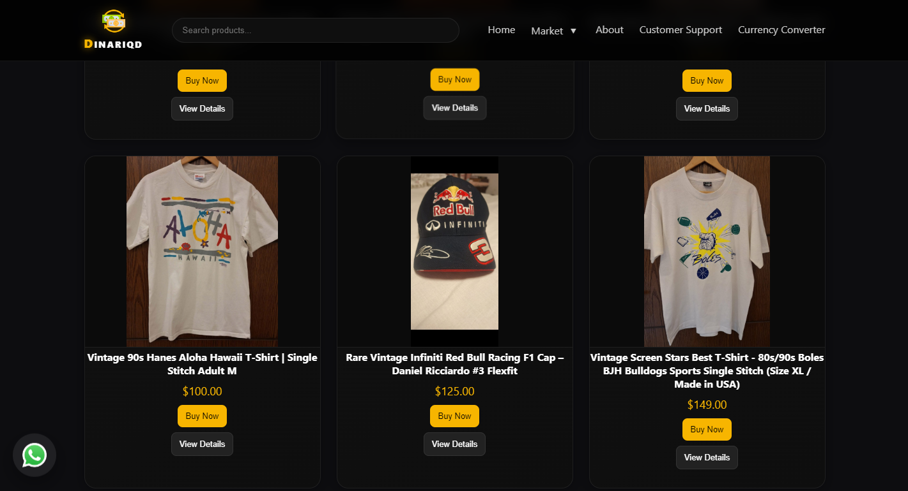
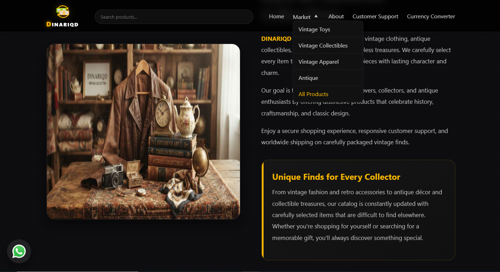

# DINARIQD

A full-stack e-commerce platform for vintage clothing, collectibles, retro products, classic accessories, and unique pre-owned items.

## Live Website

https://dinariqd.com

## Project Overview

DINARIQD is a database-driven e-commerce website built to showcase and sell vintage and collectible products through a responsive and user-friendly online store.

The platform includes product categories, dynamic product pages, product availability, pricing, product details, and an integrated checkout experience.

## Features

* Responsive e-commerce interface
* Product catalog and categories
* Dynamic product pages
* Product availability tracking
* Current and previous price display
* Product condition information
* Product search and browsing
* Category-based filtering
* Dynamic product data from MySQL
* Product image management
* Detailed product information
* Server-side validation
* PayPal payment integration
* Shipping and return information
* SEO-friendly product content
* Mobile-friendly design

## Tech Stack

### Frontend

HTML5
CSS3
JavaScript
Bootstrap
jQuery
AJAX

### Backend

PHP
MySQL
REST APIs

### Payment

PayPal

### Tools

Git
GitHub
VS Code

## Architecture

The application uses a database-driven architecture.

Customer

↓

Frontend
HTML / CSS / JavaScript

↓

PHP Backend

Product Management
Categories
Orders
Payments
Business Logic

↓

MySQL Database

## Database

MySQL is used to store and manage the dynamic data of the store.

The product system includes information such as:

Product ID
Product Name
Product Image
Price
Old Price
Quantity
Availability
Category
Likes
Description
Created Date

This allows products to be managed dynamically instead of storing product information directly inside static HTML pages.

## Product System

Each product can contain:

* Product name
* Product images
* Current price
* Previous price
* Quantity
* Availability status
* Category
* Description
* Product condition
* Creation date

The platform is designed to support vintage and pre-owned products where product condition and detailed descriptions are important.

## E-commerce Workflow

Browse Products

↓

Select Category

↓

View Product

↓

Check Price and Condition

↓

Purchase

↓

Payment

↓

Order Processing

↓

Shipping

## Payment Integration

The platform integrates PayPal to provide an online payment option.

Payment credentials and API keys are kept outside the public source code and should never be committed to the repository.

## Security

Security considerations include:

* Server-side validation
* Database protection
* Input validation
* Secure payment integration
* Protection of API credentials
* Separation of configuration files from application code
* Keeping sensitive information out of the public repository

Production passwords, API keys, access tokens, database credentials, and private configuration files should never be committed to GitHub.

## Shipping

The store provides shipping information for different regions and destinations.

Customers can view the available shipping information before completing their purchase.

## Returns

The store provides a return policy for eligible products, including products that arrive damaged or significantly different from their description.

## Responsive Design

The website is designed to work across different screen sizes, including desktop computers, laptops, tablets, and mobile devices.

## SEO

The platform uses SEO-friendly content and page structures to improve product discoverability.

SEO considerations include:

* Product titles
* Product descriptions
* Relevant keywords
* Search-friendly URLs
* Responsive design
* Structured page content
* Performance optimization

## Screenshots

### Homepage

### Product Page

### Product Categories

## Development Highlights

This project demonstrates practical experience in:

* Full-stack web development
* PHP backend development
* MySQL database design
* Dynamic e-commerce systems
* Payment API integration
* Responsive web development
* CRUD operations
* Server-side validation
* API integration
* SEO-oriented development
* Production website deployment

## Challenges

Some of the main development challenges included:

* Designing a flexible product database
* Managing product availability
* Building reusable product components
* Integrating online payments
* Creating responsive layouts
* Keeping sensitive configuration data separated from the source code
* Structuring the application for future improvements

## Future Improvements

Possible future improvements include:

* Customer accounts
* Order tracking
* Advanced product search
* Wishlist functionality
* Product reviews
* Advanced filtering
* Inventory management
* Admin analytics
* Automated email notifications
* Additional payment methods
* Improved caching and performance

## Disclaimer

This repository is intended to demonstrate the technical implementation and development experience behind the DINARIQD project.

Production credentials, private configuration files, customer information, and other sensitive data should not be included in the public repository.

## Author

Ahmed Farag

Full-Stack Web Developer

Portfolio

https://ahmedfarag.is-best.net

GitHub

https://github.com/AhmedFaraag010101
